# Systemarchitektur - Fahrschule Dorn Website

[](https://github.com/Acephali92/Fahrschule)

## Übersicht

Statische Website ohne Backend, Build-System oder Framework-Abhängigkeiten.

```
┌─────────────────────────────────────────────────────────────┐
│                        CLIENT (Browser)                      │
├─────────────────────────────────────────────────────────────┤
│  ┌─────────────┐  ┌─────────────┐  ┌─────────────────────┐  │
│  │ index.html  │  │impressum.html│ │  datenschutz.html   │  │
│  │  (Main SPA) │  │   (Legal)    │ │     (Privacy)       │  │
│  └──────┬──────┘  └─────────────┘  └─────────────────────┘  │
│         │                                                    │
│  ┌──────▼──────────────────────────────────────────────┐    │
│  │                 Inline CSS + JavaScript              │    │
│  │  • CSS Custom Properties (Design System)             │    │
│  │  • Vanilla JS (DOM Manipulation)                     │    │
│  └─────────────────────────────────────────────────────┘    │
│         │                                                    │
│  ┌──────▼──────────────────────────────────────────────┐    │
│  │                  LOKALE RESSOURCEN                   │    │
│  │  • assets/images/hero-bg.jpg                         │    │
│  │  • assets/images/infos-bg.jpg                        │    │
│  │  • assets/images/ausbildung.webp                     │    │
│  │  • assets/images/buero.jpg                           │    │
│  │  • assets/images/map-placeholder.svg                 │    │
│  └─────────────────────────────────────────────────────┘    │
└─────────────────────────────────────────────────────────────┘

┌─────────────────────────────────────────────────────────────┐
│              EXTERNE RESSOURCEN: KEINE                       │
│                                                              │
│  ✅ Alle Bilder lokal in assets/images/                     │
│  ✅ System-Fonts (kein Google Fonts)                        │
│  ✅ Kein Google Maps iFrame (nur Click-to-Link)             │
│  ✅ Keine CDNs, keine Tracking-Pixel                        │
└─────────────────────────────────────────────────────────────┘
```

## Komponenten-Hierarchie

```mermaid
graph TD
    A[index.html] --> B[Header/Navigation]
    A --> C[Main Content]
    A --> D[Footer]

    B --> B1[Logo]
    B --> B2[Desktop Navigation]
    B --> B3[Mobile Navigation]
    B --> B4[CTA Button]

    C --> C1["#start - Hero Section"]
    C --> C2["#klassen - Führerscheinklassen"]
    C --> C3["#ausbildung - Ausbildung"]
    C --> C4["#infos - Kontakt/Infos"]
    C --> C5["#behoerden - Behörden-Infos"]

    C2 --> C2a[Card: Klasse B]
    C2 --> C2b[Card: Klasse A]
    C2 --> C2c[Card: Klasse C/CE]
    C2 --> C2d[Card: BF17]
    C2 --> C2e[Card: Mofa]
    C2 --> C2f[Card: ASF/FES]
    C2 --> C2g[Card: Intensivkurs]

    C4 --> C4a[Kontaktdaten]
    C4 --> C4b[Google Maps Link - SVG Platzhalter]
    C4 --> C4c[Öffnungszeiten]

    C5 --> C5a[Accordion: Anmeldung]
    C5 --> C5b[Accordion: Dokumente]

    D --> D1[Branding]
    D --> D2[Schnelllinks]
    D --> D3[Kontakt]
    D --> D4[Öffnungszeiten]
    D --> D5[Legal Links]
```



## CSS Design System

### Custom Properties Namespace

```
:root
├── --color-primary-{50-900}   # Blau-Palette (Brand)
├── --color-accent-{400-600}   # Grün-Palette (CTA)
├── --color-slate-{50-900}     # Grau-Palette (Text/BG)
├── --color-red-{100,500,600}  # Fehler/Warnung
├── --font-system              # System Font Stack
├── --font-mono                # Monospace Stack
├── --text-{xs-6xl}            # Typography Scale
├── --leading-{tight-relaxed}  # Line Heights
├── --space-{1-24}             # Spacing Scale (rem)
├── --radius-{sm-full}         # Border Radius
├── --shadow-{sm-2xl}          # Box Shadows
└── --transition-{fast-slow}   # Timing Functions
```

### Responsive Breakpoints

| Breakpoint | CSS Media Query | Verwendung |
|------------|-----------------|------------|
| Mobile | Default | Basis-Styles |
| Tablet | `min-width: 768px` | 2-Spalten Grid |
| Desktop | `min-width: 1024px` | Desktop-Navigation sichtbar |

## JavaScript Module

Alle Scripts sind inline in `index.html` (Zeile 2011-2087).

### Event Listener Mapping


## Datenfluss

### Benutzerinteraktionen


### Netzwerkanfragen


**DSGVO-konform:** Keine externen Ressourcen werden beim Seitenladen abgerufen. Google Maps öffnet nur bei aktivem Klick in einem neuen Tab.

## Datei-Abhängigkeiten

```
index.html
├── [LOKAL] assets/images/hero-bg.jpg (Hero Background)
├── [LOKAL] assets/images/infos-bg.jpg (Infos Background)
├── [LOKAL] assets/images/ausbildung.webp (Ausbildung Image)
├── [LOKAL] assets/images/buero.jpg (Büro Image)
├── [LOKAL] assets/images/map-placeholder.svg (Karten-Platzhalter)
├── [INTERN] impressum.html (Footer Link)
└── [INTERN] datenschutz.html (Footer Link)

impressum.html
├── [INTERN] index.html (Header/Footer Links)
└── [INTERN] datenschutz.html (Nav Link)

datenschutz.html
├── [INTERN] index.html (Header/Footer Links)
└── [INTERN] impressum.html (Nav Link)

assets/images/
├── hero-bg.jpg         (289 KB - Hero-Hintergrund)
├── infos-bg.jpg        (108 KB - Kontakt-Hintergrund)
├── ausbildung.webp     (34 KB - Ausbildungsbild)
├── buero.jpg           (58 KB - Bürobild)
└── map-placeholder.svg (2 KB - Karten-Platzhalter)
```

## Performance-Optimierungen

| Technik | Implementation | Effekt |
|---------|----------------|--------|
| **Lokale Assets** | Alle Bilder in `assets/images/` | Keine externen Requests, DSGVO-konform |
| **Lazy Loading** | `loading="lazy"` auf Images | Bilder erst bei Sichtbarkeit laden |
| **Async Decode** | `decoding="async"` | Non-blocking Image Decode |
| **System Fonts** | `var(--font-system)` | Kein Font-Download erforderlich |
| **Inline CSS/JS** | Alles in HTML | Keine zusätzlichen HTTP Requests |
| **RAF Throttle** | `requestAnimationFrame` | Scroll-Performance |
| **WebP Format** | `ausbildung.webp` | Komprimiertes Bildformat |
| **SVG Platzhalter** | `map-placeholder.svg` | Vektorgrafik statt iFrame |

### Audit-Ergebnisse (Chrome DevTools)

| Metrik | Wert | Bewertung |
|--------|------|-----------|
| **LCP** (Largest Contentful Paint) | 930ms | 🟢 Gut (<2.5s) |
| **CLS** (Cumulative Layout Shift) | 0.00 | 🟢 Gut (<0.1) |
| **Externe Requests** | 0 | 🟢 DSGVO-konform |
| **Console Errors** | 0 | 🟢 Fehlerfrei |

## Accessibility (a11y)

### ARIA Implementation

| Element | ARIA-Attribute | Zweck |
|---------|----------------|-------|
| Header | `role="banner"` | Landmark |
| Navigation | `role="navigation"`, `aria-label` | Landmark + Beschreibung |
| Main | `id="main-content"` | Skip-Link Target |
| Sections | `aria-labelledby` | Verknüpfung mit Überschrift |
| Accordion | `aria-expanded`, `aria-controls` | State Communication |
| Mobile Menu | `aria-expanded`, `aria-controls` | State Communication |
| Footer | `role="contentinfo"` | Landmark |

### Keyboard Navigation

- Skip-Link vorhanden (`Zum Hauptinhalt springen`)
- `:focus-visible` Styles definiert
- `prefers-reduced-motion` Media Query implementiert

## Sicherheitsaspekte

Siehe [SECURITY.md](./SECURITY.md) für Details zu:
- Content Security Policy Empfehlungen
- External Resource Risks
- DSGVO-Compliance

## JavaScript Funktionsreferenz

### Modul-Struktur

Das gesamte JavaScript ist in einer IIFE (Immediately Invoked Function Expression) gekapselt:

```javascript
(() => {
    'use strict';
    // Alle Funktionen hier
})();
```

**Datei:** `index.html`
**Zeilen:** 2008-2087
**Ausführung:** Synchron beim Parsen des `<script>`-Tags

---

### 1. Year Update

**Zweck:** Automatische Aktualisierung des Copyright-Jahres im Footer

```javascript
const yearEl = document.getElementById('current-year');
if (yearEl) yearEl.textContent = new Date().getFullYear();
```

| Parameter | Typ | Beschreibung |
|-----------|-----|--------------|
| `yearEl` | `HTMLElement \| null` | Element mit ID `current-year` |

**Rückgabe:** `void`
**DOM-Abhängigkeit:** `#current-year`
**Fehlerbehandlung:** Null-Check verhindert Fehler bei fehlendem Element

---

### 2. Mobile Navigation Toggle

**Zweck:** Hamburger-Menü Ein-/Ausblenden

```javascript
const menuButton = document.getElementById('mobile-menu-button');
const mobileMenu = document.getElementById('mobile-menu');

menuButton.addEventListener('click', () => {
    const isOpen = mobileMenu.classList.toggle('open');
    menuButton.setAttribute('aria-expanded', isOpen);
    menuButton.setAttribute('aria-label', isOpen ? 'Menü schließen' : 'Menü öffnen');
});
```

| Variable | Typ | Beschreibung |
|----------|-----|--------------|
| `menuButton` | `HTMLButtonElement` | Hamburger-Button |
| `mobileMenu` | `HTMLElement` | Navigation Container |
| `isOpen` | `boolean` | Toggle-State |

**Events:** `click` auf `#mobile-menu-button`
**CSS-Klassen:** `.open` wird getoggelt auf `#mobile-menu`
**ARIA-Updates:** `aria-expanded`, `aria-label`

---

### 3. Mobile Menu Auto-Close

**Zweck:** Schließt Menü bei Link-Klick

```javascript
mobileMenu.querySelectorAll('a').forEach(link => {
    link.addEventListener('click', () => {
        mobileMenu.classList.remove('open');
        menuButton.setAttribute('aria-expanded', 'false');
    });
});
```

**Events:** `click` auf alle `<a>` in `#mobile-menu`
**Verhalten:** Entfernt `.open` Klasse, setzt `aria-expanded="false"`

---

### 4. Accordion

**Zweck:** Ausklappbare Inhaltsblöcke (Behörden-Infos)

```javascript
document.querySelectorAll('.accordion-trigger').forEach(button => {
    button.addEventListener('click', () => {
        const item = button.closest('.accordion-item');
        const isOpen = item.classList.contains('open');

        // Alle schließen
        document.querySelectorAll('.accordion-item').forEach(i => {
            i.classList.remove('open');
            i.querySelector('.accordion-trigger')?.setAttribute('aria-expanded', 'false');
        });

        // Aktuelles öffnen (falls vorher geschlossen)
        if (!isOpen) {
            item.classList.add('open');
            button.setAttribute('aria-expanded', 'true');
        }
    });
});
```

| Variable | Typ | Beschreibung |
|----------|-----|--------------|
| `button` | `HTMLButtonElement` | Accordion-Trigger |
| `item` | `HTMLElement` | Parent `.accordion-item` |
| `isOpen` | `boolean` | Aktueller State |

**Verhalten:** Single-Open (nur ein Accordion gleichzeitig offen)
**CSS-Klassen:** `.open` auf `.accordion-item`
**ARIA-Updates:** `aria-expanded` auf `.accordion-trigger`

---

### 5. Header Scroll Effect

**Zweck:** Schatten auf Header bei Scroll

```javascript
const header = document.querySelector('.header');
let ticking = false;

window.addEventListener('scroll', () => {
    if (!ticking) {
        requestAnimationFrame(() => {
            header.classList.toggle('scrolled', window.scrollY > 50);
            ticking = false;
        });
        ticking = true;
    }
}, { passive: true });
```

| Variable | Typ | Beschreibung |
|----------|-----|--------------|
| `header` | `HTMLElement` | Header-Element |
| `ticking` | `boolean` | RAF Throttle Flag |

**Events:** `scroll` auf `window` (passive)
**Threshold:** 50px Scroll-Position
**CSS-Klassen:** `.scrolled` auf `.header`
**Performance:** `requestAnimationFrame` Throttling

---

### 6. Intersection Observer (Fade-In Animations)

**Zweck:** Elemente einblenden bei Sichtbarkeit

```javascript
const fadeElements = document.querySelectorAll('.fade-in');

const observer = new IntersectionObserver((entries) => {
    entries.forEach(entry => {
        if (entry.isIntersecting) {
            entry.target.classList.add('visible');
            observer.unobserve(entry.target);
        }
    });
}, {
    threshold: 0.1,
    rootMargin: '0px 0px -50px 0px'
});

fadeElements.forEach(el => observer.observe(el));
```

| Option | Wert | Beschreibung |
|--------|------|--------------|
| `threshold` | `0.1` | 10% des Elements sichtbar |
| `rootMargin` | `0px 0px -50px 0px` | 50px vor unterem Viewport-Rand |

**CSS-Klassen:** `.visible` wird hinzugefügt
**Verhalten:** One-shot (unobserve nach Trigger)
**Fallback:** Browser ohne IntersectionObserver erhalten sofort `.visible`

---

### CSS-Klassen Referenz (JS-relevant)

| Klasse | Element | Getriggert durch | Effekt |
|--------|---------|------------------|--------|
| `.open` | `#mobile-menu` | Menu Toggle | `display: block`, Animation |
| `.open` | `.accordion-item` | Accordion Click | Content sichtbar |
| `.scrolled` | `.header` | Scroll > 50px | `box-shadow` hinzugefügt |
| `.visible` | `.fade-in` | IntersectionObserver | Opacity/Transform Animation |

---

### Event Listener Übersicht

| Event | Target | Handler | Zeile |
|-------|--------|---------|-------|
| `click` | `#mobile-menu-button` | Menu Toggle | 2021 |
| `click` | `#mobile-menu a` | Menu Close | 2029 |
| `click` | `.accordion-trigger` | Accordion Toggle | 2038 |
| `scroll` | `window` | Header Shadow | 2058 |
| (Observer) | `.fade-in` | Fade Animation | 2072 |

---

*Dokumentation aktualisiert: Januar 2026*
*Letzter Audit: Chrome DevTools Performance Trace*
